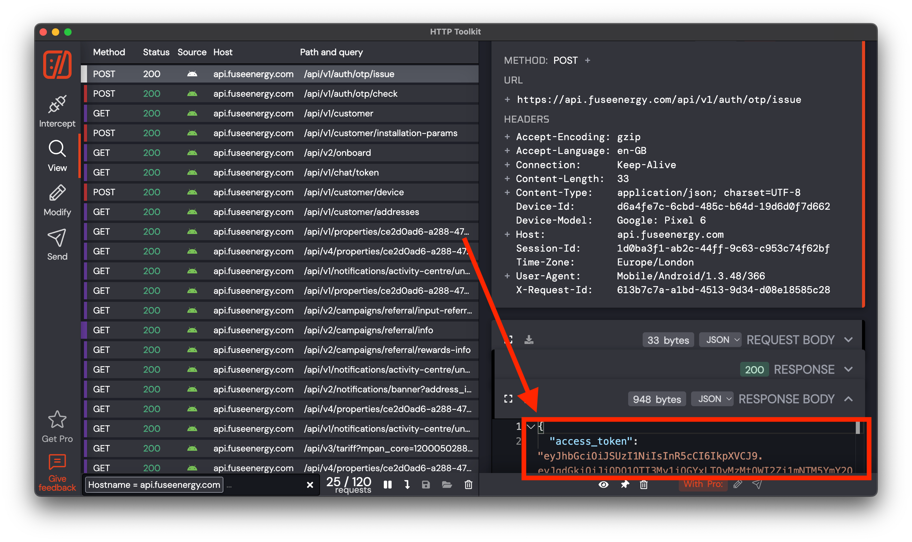

# Reading data gathering from [Fuse](https://www.fuseenergy.com/)

Reverse API for https://www.fuseenergy.com/

## How to use

### Auth

Unfortunately I couldn't get the OTP code without the mobile app, so the method on getting the access and refresh token
is complicated

#### Easy way
But you might be able to do it the easy way:

```text
POST https://api.fuseenergy.com/api/v1/auth/otp/issue
{
  "phone_number": "+44XXXXXXXXXXX"
}
```

If it's not working...

#### Hard way

1. Find a rooted Android phone. Install [HTTP Toolkit](https://httptoolkit.com/)
2. Start the authorisation under HTTPS intercept, but **don't finish it**. You will see the access token:
   
3. Make OTP check by manual HTTP request (via curl or Postman for example):
   ```text
   POST https://api.fuseenergy.com/api/v1/auth/otp/check
   Authorization: Bearer <access_token>
   {
     "code": "XXXXXX",
     "access_token_ttl": null
   }
   ```
4. Place refresh and access token in `data/config.json` folder. For example:
   ```json
   {
     "access_token": "eyJhbGciOiJSU...",
     "refresh_token": "5669e720-64..."
   }
   ```